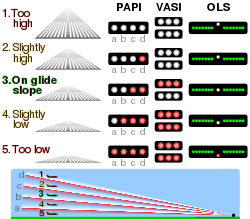
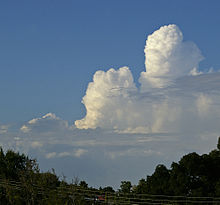
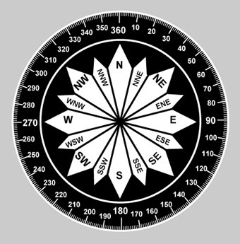

## Calculating **reciprocals** of headings

If heading is 050:
- 50 + 180 = 230 degress

If heading is 230:
- 230 + 180 = 410
- If the result is > 360, subtract 360 from it
- 410 - 360 = 50 degrees

## PAPIs - Precision Approach Path Indicators

PAPIs help pilots maintain the correct glide path to the runway, ensuring a safe and accurate landing.

Student pilots in initial training may use the mnemonic

WHITE on WHITE - "Check your height" (or "You're gonna fly all night") (too high)

RED on WHITE – "You're all right"

RED on RED – "You're dead" (too low)

# METAR

## Towering Cumulus

Towering Cumulus clouds can indicate the possibility of turbulence, updrafts, downdrafts, and other turbulent air movements. They might also be an early sign of more developed cumulonimbus clouds, which can bring more severe weather conditions like thunderstorms, lightning, heavy rain, and even hail. Pilots need to exercise caution when flying near or through areas with Towering Cumulus clouds, as they can experience sudden changes in altitude and encounter rough air.

## Ceiling

Ceiling refers to the height above the ground or water surface at which the lowest layer of clouds or significant obscuring phenomena (such as fog or precipitation) are observed. The ceiling is an important parameter for pilots, as it helps them assess the vertical visibility and the lowest level at which they can safely operate the aircraft.

## Dew point

The dew point is a fundamental concept in meteorology that refers to the temperature at which air becomes saturated with moisture and dew or frost begins to form. In simpler terms, it's the temperature at which the air would need to cool down in order to reach 100% relative humidity, causing condensation to occur.

Here's how the dew point is relevant in aviation:

Frost and Ice Formation: In colder conditions, if the air temperature is at or below the dew point, frost or ice can form on aircraft surfaces. This can affect the aircraft's aerodynamics, performance, and safety. Pilots need to be aware of the dew point temperature to anticipate potential ice accumulation and take appropriate precautions, such as de-icing or anti-icing procedures.

Icing Conditions: When the temperature of an aircraft is at or below the dew point and it encounters visible moisture (such as clouds, rain, or snow), there's a risk of ice forming on critical surfaces, including wings, engines, and sensors. Pilots must consider dew point and air temperature when evaluating the potential for icing and deciding whether to adjust their flight path or altitude.

Fog and Low Visibility: Dew point is closely related to the formation of fog, which can reduce visibility at airports and along flight paths. Understanding the relationship between dew point and air temperature helps pilots anticipate the likelihood of fog formation and its potential impact on takeoff, approach, and landing procedures.

## Compass
Just a compass to help with understanding headings/degrees.

## A320 Pilot / custom waypoints

PLACE /  BRG/HDG /  DIST
